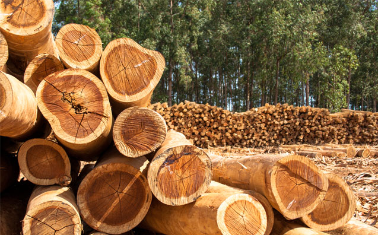

  

# Projeto de extensão:   Hiperfocalização comercial de madereiras na floresta Amazônica

## 🌳 Contexto

Estudos realizado entre 2007 e 2020 pela [Imaflora](https://imaflora.org/noticias/estudo-inedito-mostra-que-2-das-especies-disponiveis-compoe-mais-da-metade-da-exploracao-madeireira-na-amazonia-brasileira) apontam que apenas **2%** das espécies de madeiras florestais tem sido exploradas à exaustão, ou seja cerca de 15 a 20 espécies estão sendo levadas ao esgotamento, sendo que algumas delas são consideradas vulneráveis. De 2020 para 2026 este cenário não mudou muito e o subaproveitamento de madeiras continua alto. As principais causas para essa rígida concentração seriam o conservadorismo do mercado, falta de conhecimento tecnológico e científico, diferentes regulagems para espécies e a exploração/concorrência ilegal.

Este projeto visa demonstrar quais espécies fora do radar comercial poderiam ser aproveitadas, analisando principalmente características parecidas entre os dois arquétipos descritos anteriormente.
## Perguntas

- [ ] Qual o ranking das 15 espécies com maior dureza Janka paralela seca (dureza_janka_paralela_seca) combinada com densidade classificada como "Média" ou "Pesada"?

- [ ] Qual a correlação (Pearson/Spearman) entre densidade_basica e flexao_seca_mor (módulo de ruptura)? É estatisticamente significativa?

- [ ]  A distribuição de densidade_classificacao difere significativamente entre os estados de coleta (PA, AM, RO, MA)?

- [ ] Quais são as 5 famílias botânicas com maior número de espécies na base, e qual % do total de 269 espécies elas representam?

- [ ] Qual a relação entre secagem_duracao_dias e classificacao_tempo_secagem? Quantas espécies caem em "Muito Lenta > 20 dias"?

- [ ] Quais espécies têm propriedades mecânicas (dureza, compressão paralela seca) dentro do intervalo interquartil das espécies classificadas como "Pesada" mas pertencem a famílias com poucas espécies na base (potenciais "sub-exploradas")?

## 📋 Descrição das colunas
### Colunas chaves
| `Nome` | `Descrição` |
| :--- | :--- |
| **id_especie** | val2 |
| **nome_cientifico**  | val2 |
| **nome_popular_1**  | val2 |
| **genero**  | val2 |
| **especie**  | val2 |
| **familia**  | val2 |

### Para que essa madeira serve?
Preferível as versões "secas" em relação às "verdes"
| `Nome` | `Descrição` |
| :--- | :--- |
| **densidade_basica** | qualidade da madeira |
| **densidade_aparente**  | qualidade da madeira |
| **contracao_tangencial**  | val2 |
| **contracao_radial**  | val2 |
| **contracao_volumetrica**  | val2 |
| **relacao_tangencial_radial**  | val2 |
| **flexao_seca_moe** | v2 |
| **flexao_seca_mor**  | v2|
| **compressao_paralela_seca**  | val2 |
| **dureza_janka_paralela_seca**  | val2 |
| **dureza_janka_transversal_seca**  | val2 |
| **cisalhamento_seca**  | val2 |

### Estética - uso para móveis/acabamento nobre
| `Nome` | `Descrição` |
| :--- | :--- |
| **cor_cerne_classificacao** | val2 |
| **textura**  | val2 |
| **gra**  | val2 |
| **brilho**  | val2 |
| **figura_tangencial**  | val2 |
| **figura_radial**  | val2 |
| **cerne_alburno**  | val2 |

### Processamento - viabilidade industrial
| `Nome` | `Descrição` |
| :--- | :--- |
| **secagem_duracao_dias** | quantos dias demora para secar |
| **secagem_programa_utilizado**  | val2 |

## Arquitetura do projeto

## Fontes
